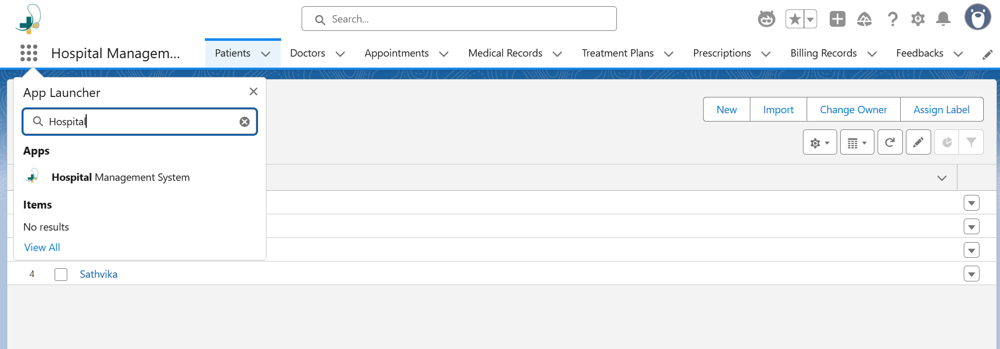
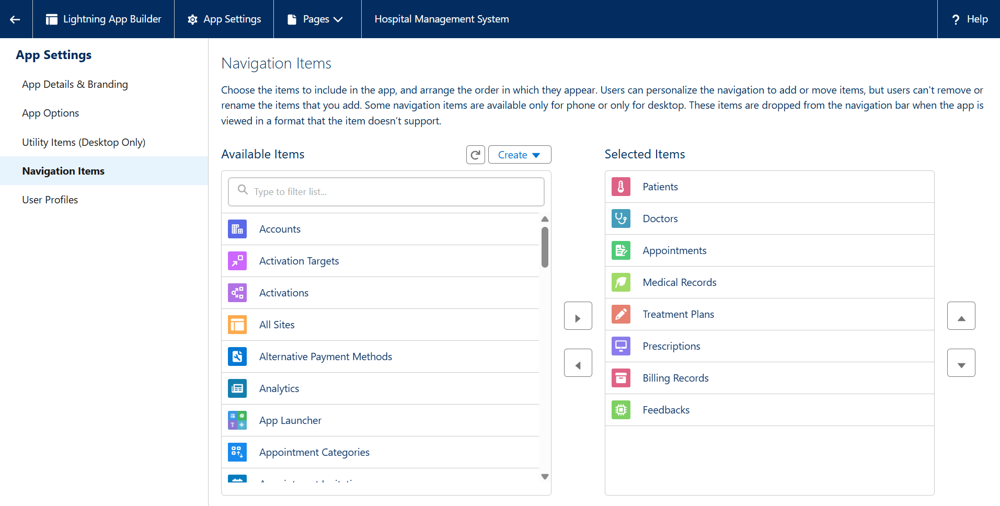
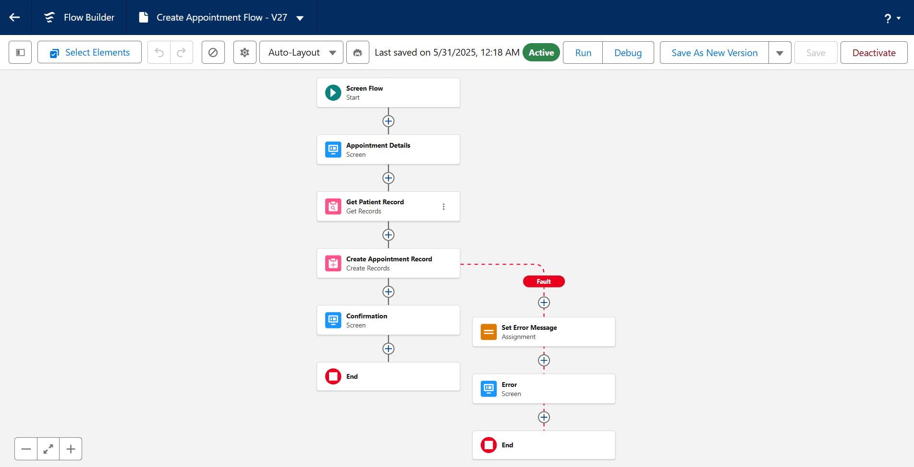
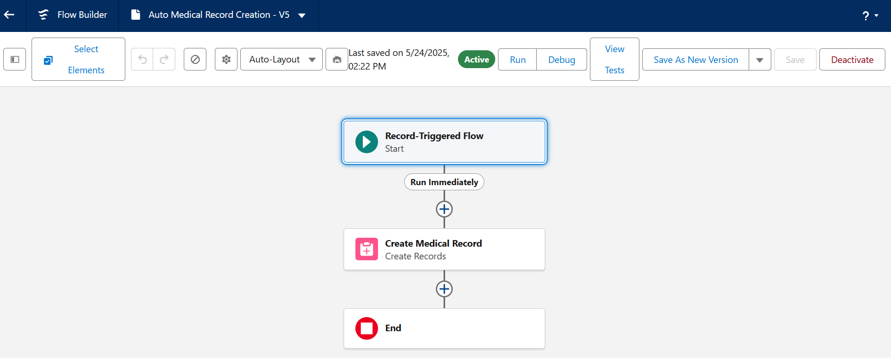
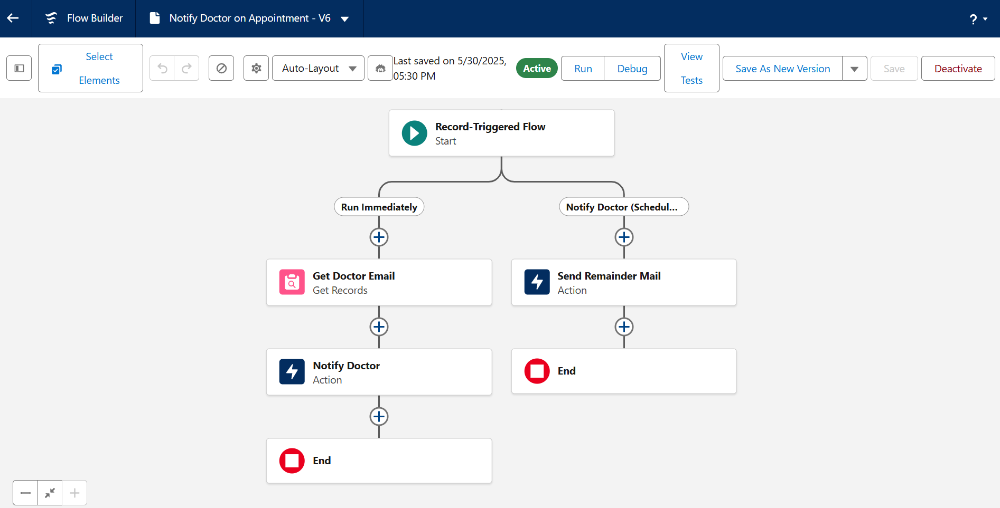
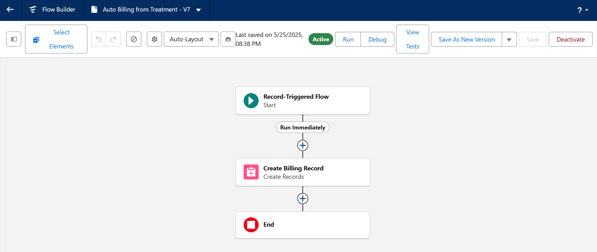
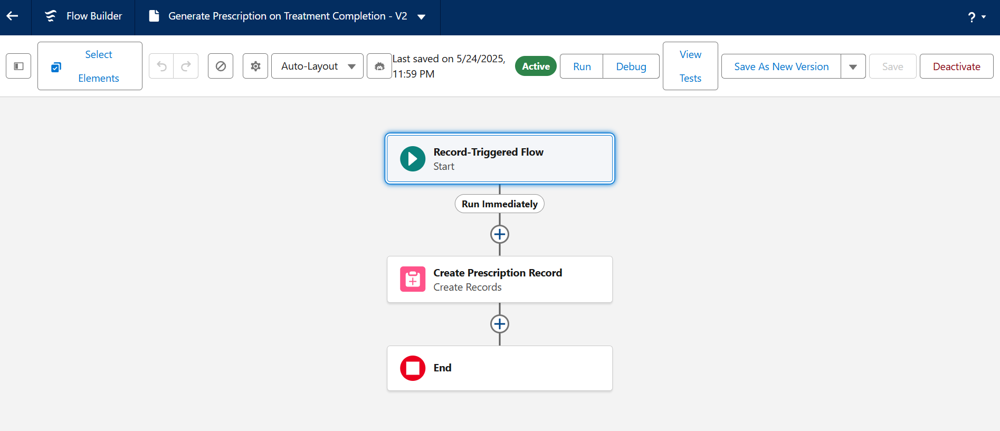
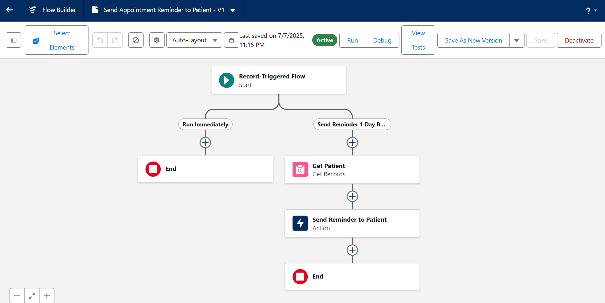
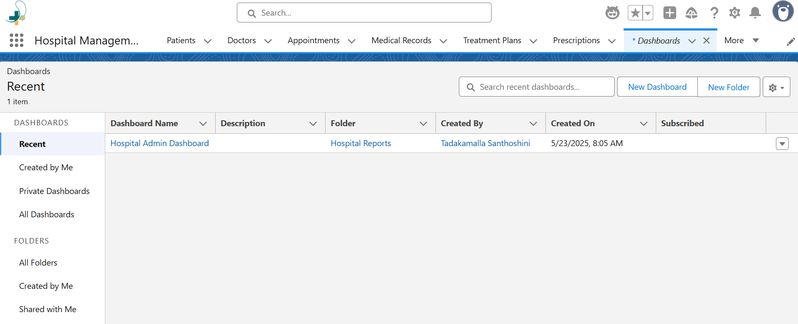
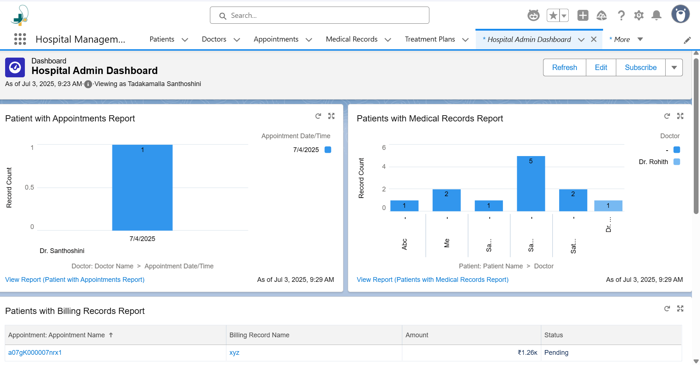

# salesforce-hospital-management-system

This project is a custom-built Hospital Management System (HMS) developed in a Salesforce Developer Org using Flow Automation. It streamlines hospital workflows such as scheduling appointments, notifying doctors, and creating records without writing code.

## Key Features

-  Automatically create Medical Records when an Appointment is scheduled  
-  Notify the assigned Doctor via email upon Appointment creation  
-  Auto-generate Prescription Templates when Treatment Plans are completed  
-  Auto-create Billing Records upon Treatment completion  
-  Send Email Reminders to Patients before their Appointment time

## Tools & Technologies Used

- Salesforce Developer Org  
- Flow Builder (Record-Triggered Flows, Scheduled Paths)  
- Email Alerts and Templates  
- Custom Objects (Appointment, Medical Record, Prescription, Billing, etc.)

## What I Learned

- Designing real-world hospital workflows using Salesforce Flows  
- Managing object relationships like Patient ↔ Appointment ↔ Doctor  
- Implementing email alerts and flows  
- Debugging flow issues and handling email delivery challenges

## Screenshots

1. **App Launcher – Search Hospital Management System**  
   

2. **Custom Objects Included**  
   _(Appointment, Patient, Doctor, Medical Record, Prescription, Billing, etc.)_  
   

3. **Create Appointment Flow (Screen Flow)**  
   A screen flow that collects patient, doctor, and date inputs to create a new appointment.
   

5. **Auto Medical Record Creation Flow**  
   Triggered when an appointment is created, automatically generates a related medical record. 
   

6. **Notify Doctor via Email Flow**  
   Sends an automated email to the assigned doctor with appointment details upon creation.  
   

7. **Auto Billing on Treatment Completion**  
   When a treatment is marked as completed, this flow creates an unpaid billing record.  
   

8. **Generate Prescription on Treatment Completion**  
   Creates a prescription record with medicines and notes when treatment is completed.  
   

9. **Send Appointment Reminder to Patient**
   Sends a reminder email to the patient one day before their scheduled appointment.  
   

10. **Hospital Admin Dashboard**    
   

11. **Dashboard View**  
   _Displays key metrics and patient insights._  
   
